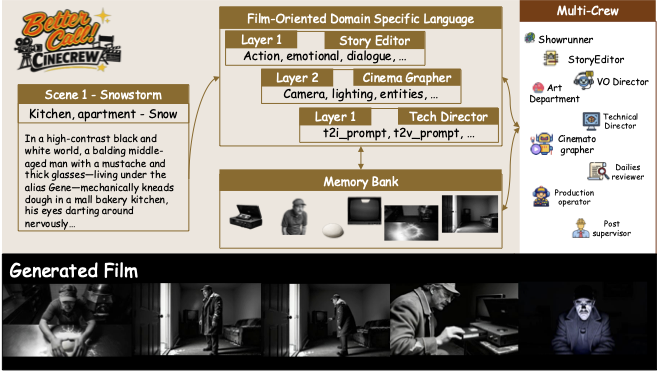
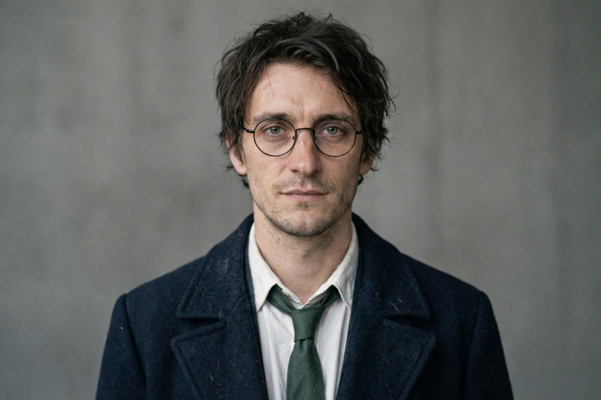
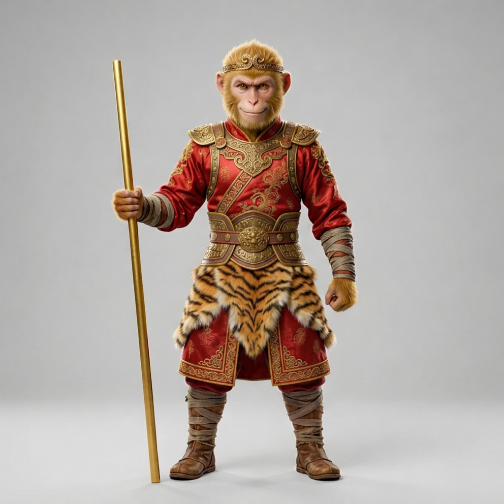

<div align="center">

# Better Call CineCrew: Consistent Ultra-Long Narrative-to-Film Generation

[](https://eccv.ecva.net/)
[](https://jiabenchen.github.io/cinecrew/)
[](https://github.com/Ironieser/CineCrew)
[](https://arxiv.org/abs/2609.07720)
[](LICENSE)

**Jiaben Chen**<sup>1\*</sup> · **Sixun Dong**<sup>1\*</sup> · Qinhong Zhou<sup>1</sup> · Raine Ma<sup>1</sup> · Zhiyang Dou<sup>2</sup> · Wojciech Matusik<sup>2</sup> · Chuang Gan<sup>1†</sup>

<sup>1</sup> University of Massachusetts Amherst &nbsp;&nbsp; <sup>2</sup> Massachusetts Institute of Technology<br>
<sub>\* equal contribution &nbsp; † corresponding author</sub>

</div>

<p align="center">
  <br>
  <em>CineCrew is a structured orchestration layer for narrative-to-film generation. At its center is
  FilmDSL, a film-oriented domain-specific language that explicitly encodes cinematic constraints —
  shots, camera directives, assets, and character personas — so that a crew of agents coordinates
  through one shared specification for planning, generation, critique, and repair.</em>
</p>

---

## 🚀 Overview

Long-form narrative-to-film generation requires **shot-level controllability** and
**cross-clip consistency** in both visual identity and character behavior —
requirements that remain difficult to satisfy with prompt-based workflows. A core
reason existing workflows stay brittle is the lack of a structured intermediate
layer between scripts and video models, especially when screenplays are
underspecified at key cinematic decision points.

**CineCrew** is a structured orchestration layer for film-oriented script-to-video
generation, implemented as a multi-agent framework that operates between scripts
and off-the-shelf video generators. The layer is centered on **FilmDSL**, a
film-oriented domain-specific language that makes cinematic constraints explicit —
shot and camera directives, asset and continuity requirements, and persona cues —
so that agents coordinate through a shared structured specification for planning,
generation, critique, and repair. A generation agent constructs asset packs and
storyboard keyframes that anchor composition before clip-by-clip synthesis, while a
critic agent produces structured QA signals and triggers targeted refinement
without retraining the base model.

Under this layer, consistency is treated as a **first-class objective rather than an
emergent property of prompting**: appearance and persona requirements are specified
by DSL-defined constraints *before* generation begins, and failures are diagnosed
and repaired with feedback aligned with film-production needs.

## ✨ Key Highlights

- **A structured orchestration layer** for film-oriented script-to-video generation
  that bridges long-form screenplays and off-the-shelf video models, explicitly
  modeling cinematic structure and continuity constraints to enable controllable and
  consistent long-form video synthesis.
- **FilmDSL**, a domain-specific language designed specifically for film generation.
  FilmDSL converts screenplays into a machine-actionable representation of cinematic
  intent, including shot structure, camera directives, assets, continuity links, and
  character-direction signals.
- **A multi-agent film generation framework unified by FilmDSL**, where the DSL serves
  as the shared operational protocol for all agents, governing planning, generation,
  critique, and refinement within a single structured workflow.

## 📅 News

- **2026.09** — Code, examples and project page released.
- **2026.03** — *Better Call CineCrew* accepted to **ECCV 2026**.

## 🏗️ Architecture

CineCrew is organized as a film-production-style pipeline with role-specialized
modules ("crew") that collaboratively compile a narrative into executable
generative controls and iteratively refine outputs, spanning **pre-production**,
**production** and **post-production**:

```
pre-production   Showrunner ─▶ meta m        Art Department ─▶ asset library A       Production Rulebook M
                 Story Editor ─▶ beats  ─▶  Acting Coach ─▶ Cinematographer ─▶ Technical Director  ─▶  FilmDSL D
production       Production Operator: keyframe k_i ─▶ clip v_i        Dailies Reviewer: QA report ─▶ revise & retry
post-production  VO Director (dialogue → voice track)        Post Supervisor (merge, subtitles, sound layers)
```

**FilmDSL** is stored as a single merged JSON object `D = {meta, assets, memory, clips[]}`.
Pre-production artifacts are not merely external context: they are referenced and
enforced through FilmDSL as global headers and per-clip constraints.

| FilmDSL component | Produced by | Contents |
|---|---|---|
| **Meta `m`** (global headers) | Showrunner | Production-wide constraints and style priors — FPS, aspect ratio, tone, era, location, cast — inherited by every clip |
| **Asset library `A`** | Art Department | Character sheets (identity anchors, wardrobe, a compact **Persona Schema**) and set assets, recorded as stable references (`char_*`, `loc_*`, `prop_*`) |
| **Production Rulebook `M`** | all crew | Static domain priors (staging heuristics, anti-hallucination / anti-spawning constraints, naming conventions) plus runtime feedback from the evaluation–retry loop, injected selectively into each role |
| **Clip spec `d_i = (a_i, s_i, r_i)`** | see below | One entry per clip, three layers |
| &nbsp;&nbsp;Layer 1 — Narrative Action `a_i` | Story Editor (+ Acting Coach, VO Director) | What happens: action, emotion, dialogue; beat-level performance cues |
| &nbsp;&nbsp;Layer 2 — Cinematic Staging `s_i` | Cinematographer (+ DSL Validator) | How it is filmed: shot type, camera move, framing, lighting, structured entities/props, and continuity hooks binding the clip to assets and memory |
| &nbsp;&nbsp;Layer 3 — Render Specification `r_i` | Technical Director | Tool-ready instructions: keyframe prompt, video prompt, negative prompt, generator arguments (duration, FPS, aspect ratio, seed) |

**Production loop.** For each clip the Production Operator first synthesizes a
storyboard-like keyframe `k_i` conditioned on the asset references and memory
constraints, then runs the video generator on `(k_i, video_prompt)` — the
audio-video branch for dialogue clips, the video branch otherwise. The **Dailies
Reviewer** reviews the result and, on rejection, proposes targeted edits (continuity
fields first, then keyframe prompt, then video prompt) and the clip is re-rendered;
each refinement is recorded into the Rulebook state so corrections persist across
clips. Finally the **Post Supervisor** assembles the long-form sequence.

The paper's crew ↔ code mapping is in [`DEV_NOTES.md`](DEV_NOTES.md).

## 📦 Installation & Usage

```bash
git clone https://github.com/Ironieser/CineCrew.git
cd CineCrew
python -m venv .venv && source .venv/bin/activate     # Python 3.10+
pip install -r requirements.txt

cp .env.example .env         # put your LLM key in .env (OpenAI / Azure / any OpenAI-compatible endpoint)
python run_dataset_story.py our_dataset/BetterCallSaul2
```

This runs the whole crew on a bundled scene and writes the FilmDSL plan and video
job specs to `data/runs/dataset/BetterCallSaul2/<run_id>/`. Only an LLM key is
required; the image and video generators (Qwen-Image and Wan 2.2 by default, or any
OpenAI-compatible backend) are configured in `.env` and used when execution is
turned on. Configuration, outputs, execution with the visual judge, swapping
backends, examples and ablations are documented in [`docs/USAGE.md`](docs/USAGE.md).

## 🎬 Demo & Gallery

### Featured demo — *The Monkey King at Hogwarts*

A long-form demo showing script-driven story progression, cross-shot character
consistency, cinematic staging, and agent-based production planning — watch it with
audio on the [project page](https://ironieser.github.io/CineCrew/).

> **Script.** In a magical academy, the young wizard **Harry** meets the Monkey King
> **Sun Wukong**. What begins as a suspicious first encounter turns into an unlikely
> friendship after they work together to stop a runaway broom accident and leave the
> courtyard side by side.

**Reference assets** (identity / set anchors used for cross-shot consistency):

<p align="center">
  
  
  
  
  
  
</p>
<p align="center"><em>Harry&nbsp;·&nbsp;Wukong&nbsp;·&nbsp;Hallway&nbsp;·&nbsp;Training Room&nbsp;·&nbsp;Courtyard&nbsp;·&nbsp;Broom</em></p>

<details>
<summary><b>Story timeline</b> (12 shots, generated as one coherent sequence)</summary>

| Shot | Title | Beat |
|----|-------|------|
| 0  | Huaguo Mountain | Sun Wukong stands above the sea of clouds at dawn as mythic wind and mist begin the journey. |
| 1  | Arrival | He lands inside the academy hallway, surrounded by fading white mist and wet stone reflections. |
| 2  | First Meeting | Harry appears and the two size each other up in a tense but controlled first encounter. |
| 3  | The Warning | Harry explains that something is wrong in the training room ahead. |
| 4  | Doorway | They arrive at the training room entrance, where something inside is already clearly off. |
| 5  | Accident Reveal | A runaway broom and flying papers turn the room into a contained magical accident. |
| 6  | Wukong Reacts | Wukong reads the danger quickly and begins moving into action. |
| 7  | Teamwork | Harry and Wukong cooperate to slow, redirect, and finally contain the broom. |
| 8  | Post-Action Dialogue | With the room calm again, tension gives way to dry humor and mutual respect. |
| 9  | Exit | They leave the training room together, now clearly moving as companions. |
| 10 | Courtyard | In the open courtyard, their conversation becomes warmer and more relaxed. |
| 11 | Bench Ending | They sit together as the camera pulls back, ending on the quiet start of a new friendship. |

</details>

### Baseline comparison — vs. LTX-Studio

Side-by-side videos against LTX-Studio on three representative cases
(*Spider-Man*; *Better Call Saul* Ep. 1 and Ep. 2) are on the
[project page](https://ironieser.github.io/CineCrew/#comparison)
(source in [`docs/website/`](docs/website/), published by GitHub Actions).

## 👥 Authors

[Jiaben Chen](mailto:jiabenchen@umass.edu)<sup>1\*</sup>, [Sixun Dong](https://github.com/Ironieser)<sup>1\*</sup>, Qinhong Zhou<sup>1</sup>, Raine Ma<sup>1</sup>, Zhiyang Dou<sup>2</sup>, Wojciech Matusik<sup>2</sup>, Chuang Gan<sup>1†</sup>

<sup>1</sup> University of Massachusetts Amherst · <sup>2</sup> Massachusetts Institute of Technology · \* equal contribution · † corresponding author

Code maintained by Sixun Dong ([@Ironieser](https://github.com/Ironieser)).

## 📚 Citation

```bibtex
@inproceedings{chen2026cinecrew,
  title     = {Better Call CineCrew: Consistent Ultra-Long Narrative-to-Film Generation},
  author    = {Chen, Jiaben and Dong, Sixun and Zhou, Qinhong and Ma, Raine and
               Dou, Zhiyang and Matusik, Wojciech and Gan, Chuang},
  booktitle = {Proceedings of the European Conference on Computer Vision (ECCV)},
  year      = {2026},
  note      = {Jiaben Chen and Sixun Dong contributed equally}
}
```

## 🙏 Acknowledgments

The default backends are [Qwen-Image](https://github.com/QwenLM/Qwen-Image) for keyframes
and [Wan 2.2](https://github.com/Wan-Video/Wan2.2) for video; structured LLM output is
handled by [instructor](https://github.com/567-labs/instructor) and
[pydantic](https://github.com/pydantic/pydantic) on top of the
[OpenAI Python SDK](https://github.com/openai/openai-python). We thank
[LTX-Studio](https://ltx.studio/) for serving as the commercial baseline in our comparisons.

## 📄 License

Apache License 2.0 — see [LICENSE](LICENSE).

<div align="center">

[Overview](#-overview) · [Highlights](#-key-highlights) · [Architecture](#%EF%B8%8F-architecture) · [Install](#-installation--usage) · [Usage guide](docs/USAGE.md) · [Demo](#-demo--gallery) · [Citation](#-citation)

</div>
